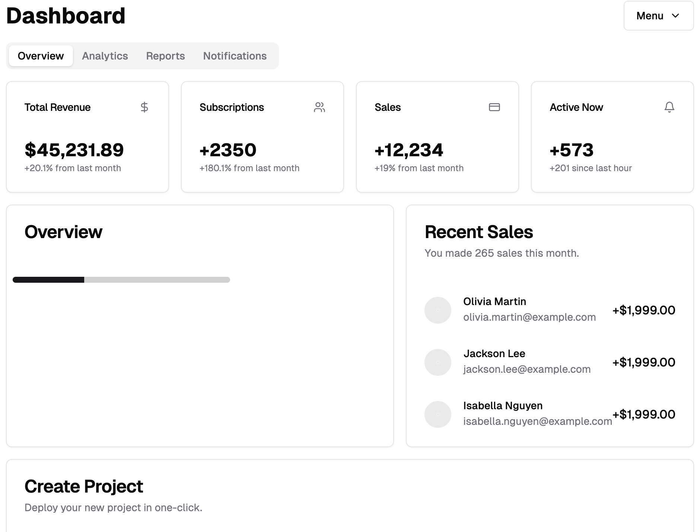

# Basic Example

## Description

An example shadcn dashboard component. Showcasing many shadcn UI components.

## Installation

Copy `BasicExample.tsx` and place it in your `/components/ui folder` of your next.js project.

## Usage

```typescript
import { Dashboard } from "@/components/ui/BasicExample";

<Dashboard />;
```

## Screenshot



## Author

skllzrmy using v0.dev
