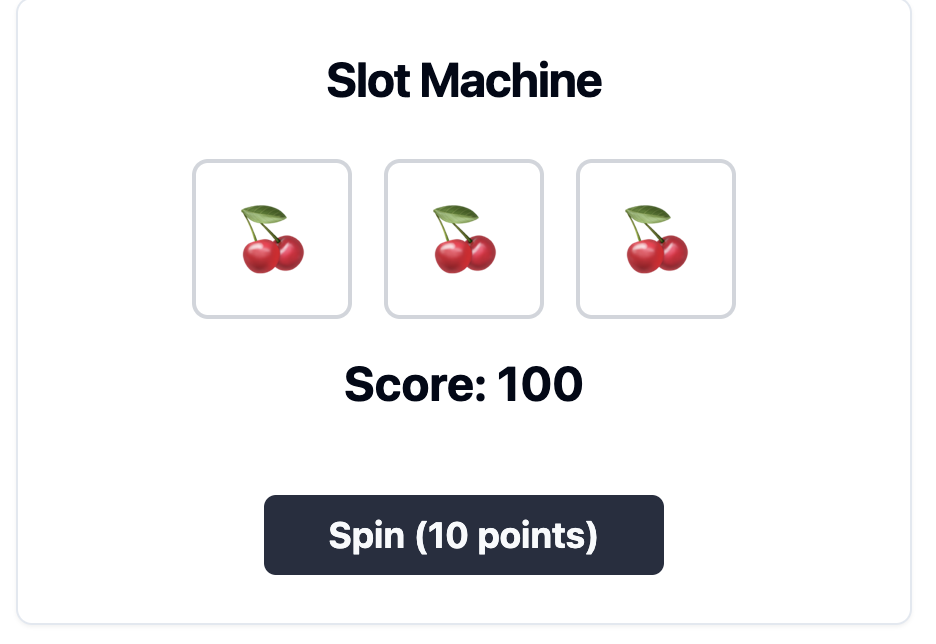

# Slot Machine

## Description

A working, animated slot machine with basic functionality

## Installation

Copy `SlotMachine.tsx` and place it in your `/components/ui folder` of your next.js project.

## Usage

```typescript
import SlotMachine from "./components/ui/SlotMachine";

export default function App() {
    return <SlotMachine />;
}
```

## Screenshot



## Demo

-   [Live Demo](https://dkrjjf-3000.csb.app/)
-   [codesandbox](https://codesandbox.io/p/devbox/shadcn-playground-forked-dkrjjf)

## Author

skllzrmy using v0.dev
