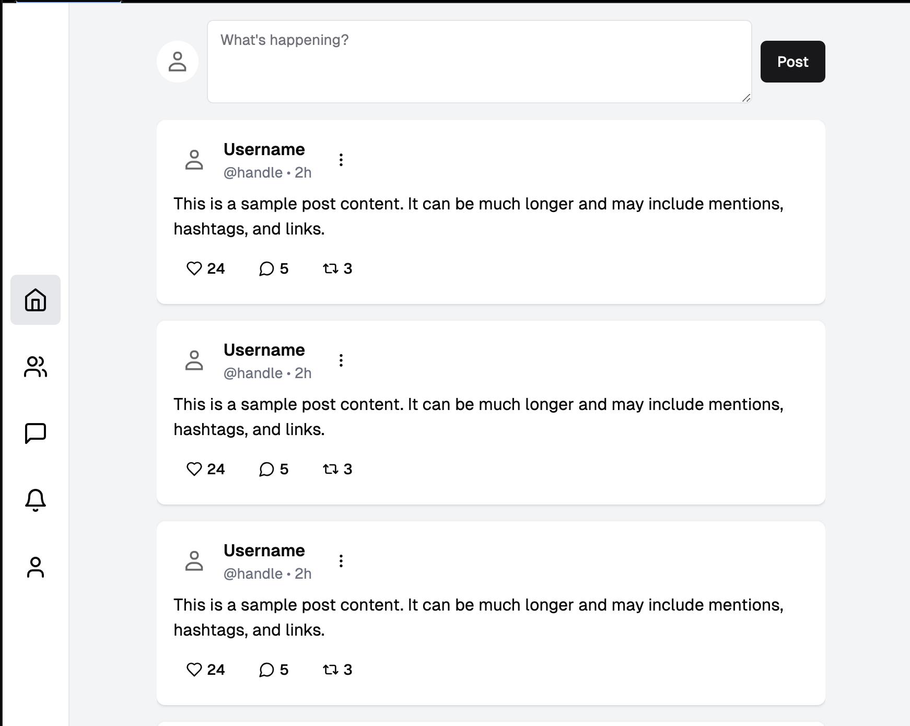

# Social Media Client Example

## Description

An example social media client which could be used for Farcaster or Mastodon, etc. Showcasing many standard shadcn UI components.

## Installation

Copy `SMClient.tsx` and place it in your `/components/ui folder` of your next.js project.

## Usage

```typescript
import SMClient from "@/components/ui/SMClient";

<SMClient />;
```

## Screenshot




## Author

skllzrmy using v0.dev
