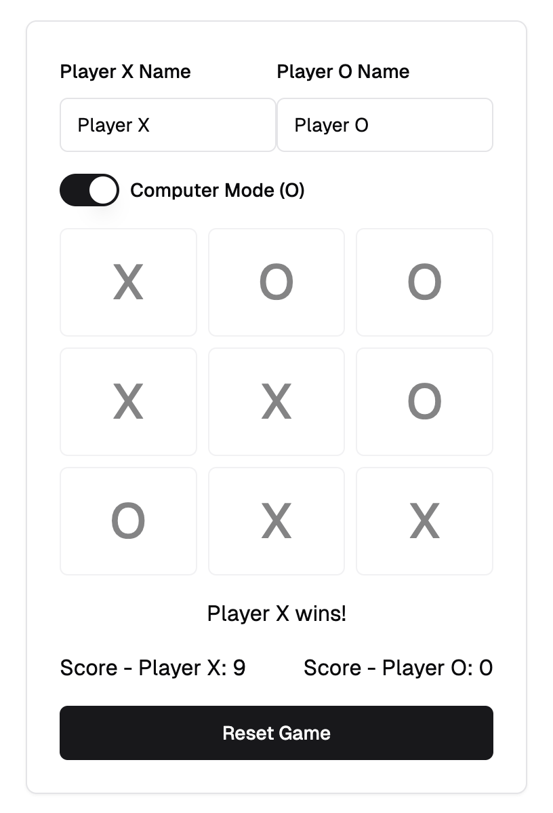

# Basic Example

## Description

An example Tic Tac Toe game. Showcasing many shadcn UI components. The computer logic is quite easy to beat, but it provides a working example.

## Installation

Copy `tic-tac-toe.tsx` and place it in your `/components/ui folder` of your next.js project.

## Usage

```typescript
import TicTacToe from "./path-to-component/tic-tac-toe";

export default function GamePage() {
    return (
        <div className="container mx-auto py-10">
            <h1 className="text-3xl font-bold mb-6 text-center">Tic Tac Toe</h1>
            <TicTacToe />
        </div>
    );
}
```

## Screenshot



## Author

skllzrmy using v0.dev
